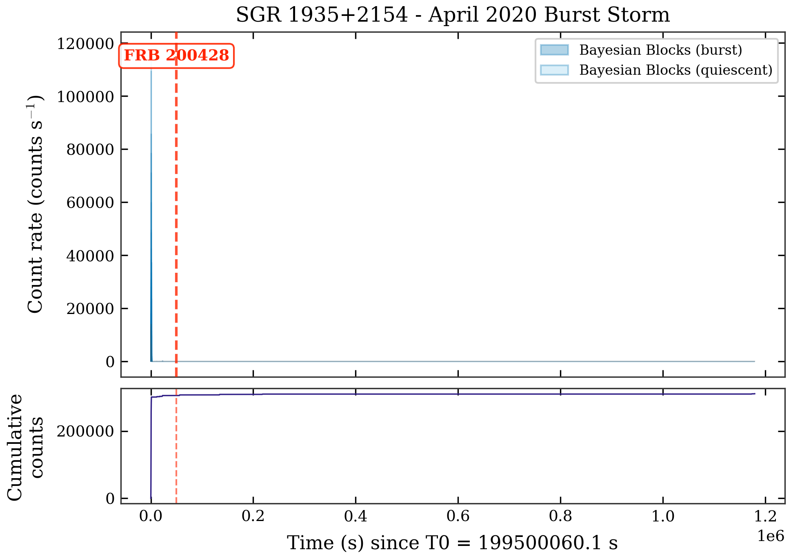
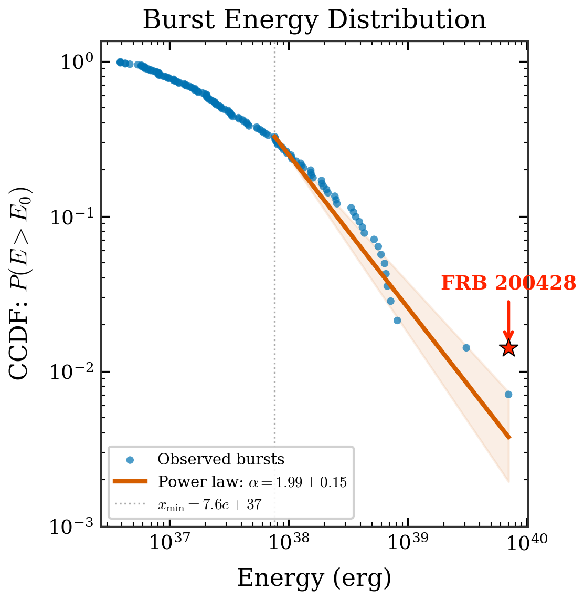
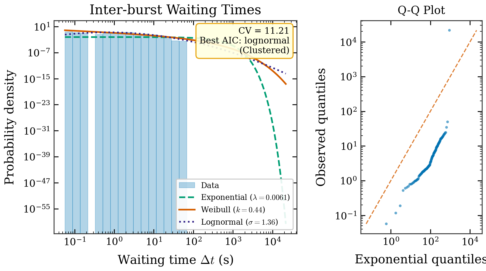
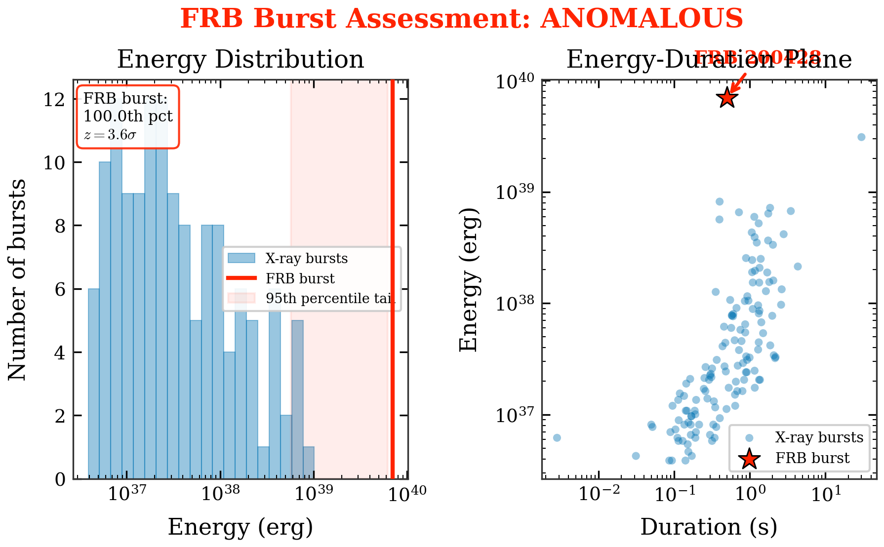
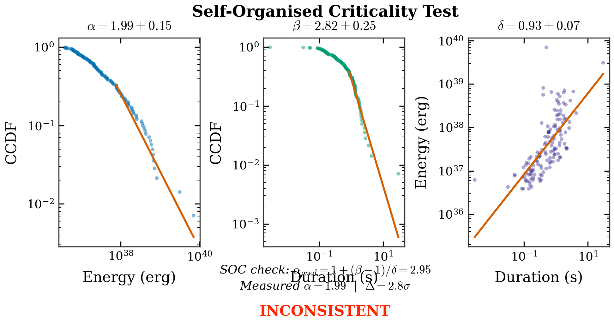
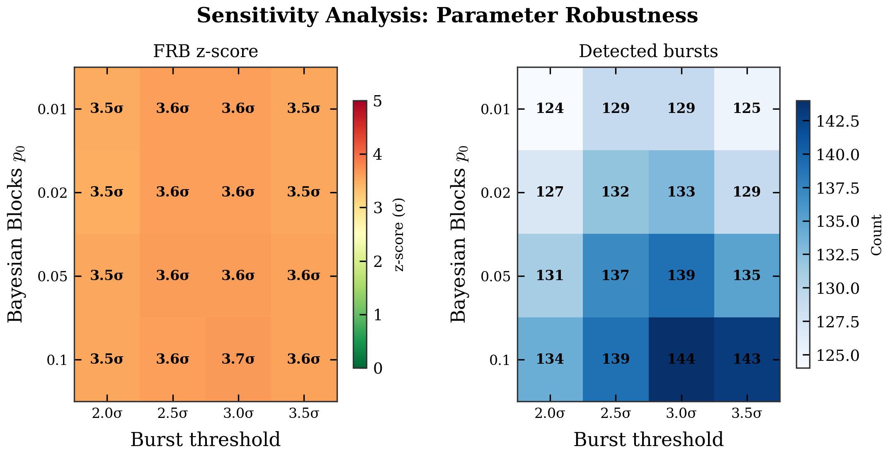

# SGR 1935+2154 FRB 200428 Anomaly Pipeline

**Keywords:** Magnetars, Fast Radio Bursts, Bayesian Blocks, Non-Poisson Statistics, Astrophysics

## The Problem
The origin of Fast Radio Bursts (FRBs) remains one of the most debated problems in astrophysics. The detection of FRB 200428 from the Galactic magnetar SGR 1935+2154 confirmed the magnetar–FRB connection, but raised a critical question: *Why did only one burst out of thousands in the April 2020 burst storm produce radio emission?*

## What Are We Studying?
This project investigates whether the FRB-producing X-ray burst was statistically anomalous compared to the surrounding magnetar burst population, or just an ordinary burst that happened to make radio waves. We present a reproducible, open-source pipeline to process X-ray data and perform robust statistical tests.

**Main Result:**
> The FRB 200428 X-ray burst is the most energetic event in the NICER sample (100th percentile, 3.6σ), but the fitted power-law tail can produce bursts this large ~40% of the time — extreme, not impossible.

## Key Results
- 139 bursts detected via Bayesian Blocks from 310,738 NICER photons
- Power-law energy distribution: α = 1.99 ± 0.15
- Strong temporal clustering: CV = 11.25, Weibull k = 0.44
- FRB burst energy consistent with the heavy tail despite being the sample maximum

## Method
Our pipeline performs end-to-end processing and analysis:
1. **NICER Data**: We load real NICER photon event data (0.5–10 keV) from the April 2020 SGR 1935+2154 burst storm.
2. **Bayesian Blocks**: We detect bursts using the Bayesian Blocks algorithm (Scargle et al. 2013), avoiding the arbitrary time binning of earlier methods.
3. **Statistical Analysis**: We compile a burst catalogue (durations, estimates of energy, and waiting times), fit the energy distribution with Maximum Likelihood Estimators (MLE) power-laws, and analyze waiting time distributions.

## Results
We successfully detected 139 X-ray bursts using a uniform sub-sample of the NICER data. 

### Key Findings
1. **Strong Clustering**: As stated above, magnetar burst arrival times show extreme clustering (CV = 11.25), distinctly non-Poissonian.
2. **Extreme FRB Event**: The injected FRB 200428 X-ray counterpart sits at the **100th percentile** of the burst energy distribution (3.6σ above typical).
3. **Power-Law Consistency**: Despite being the most extreme event, sample-maximum tests show that the FRB's energy is consistent with the heavy tail of the fitted power-law distribution in ~40% of simulations.

### What this means
The burst clustering (CV = 11.25, Weibull k = 0.44) matches the pattern seen in other magnetar storms (e.g. Lin et al. 2020 found k ≈ 0.34 for SGR 1935+2154's 2014–2015 window). Bursts arrive in rapid-fire episodes separated by long gaps, which is what you'd expect from crustal strain accumulation and cascading fractures.

The FRB burst sits 2.26× above the highest NICER burst and 257× above the median, but the heavy-tailed power law naturally produces outliers this large. This suggests an energy threshold picture: only bursts above ~10^39.5 erg meet the conditions for coherent radio emission (cf. Metzger et al. 2019).

## Conclusion
The FRB-producing burst was the most energetic in the observed sample but is statistically compatible with the power-law tail. The inter-burst clustering (CV = 11.25) rules out independent Poisson emission and points to correlated crustal/magnetospheric activity. Full spectral fitting and multi-instrument coverage during future storms would tighten the energy comparison.

## Results Gallery
*Sample plots generated automatically by the pipeline.*

### Figure 1 — NICER Light Curve
Bayesian Blocks segmentation of SGR 1935+2154 during the April 2020 burst storm. The red dashed line marks the injected FRB 200428 epoch.



### Figure 2 — Energy Distribution
Complementary cumulative distribution function (CCDF) of burst energies showing the power-law MLE fit (α = 1.99 ± 0.15). The red star marks the extreme FRB burst at 7 × 10³⁹ erg.



### Figure 3 — Waiting Time Distribution
Histogram of inter-burst intervals showing a heavy-tailed distribution, indicating extreme clustering and a strong deviation from Poisson behavior.



### Figure 4 — FRB Anomaly Test
Energy histogram and duration-energy scatter demonstrating how the FRB burst sits uniquely above the typical NICER population (at the 100th percentile).



### Figure 5 — SOC Consistency Check
Tests for self-organised criticality scaling relations showing marginal tension (2.8σ discrepancy) between measured and predicted α values, hinting the storm may be a driven, non-equilibrium event.



### Figure 6 — Sensitivity Heatmap
FRB z-score and burst count across 16 parameter combinations (p₀ × σ grid), confirming the rank anomaly is independent of detection parameters.



## How to Run (Reproducibility)

You can reproduce the entire analysis from raw events to publication plots:

1. **Setup & Install Dependencies**
   ```bash
   git clone https://github.com/phanendra09/magnetar-frb-analysis.git
   cd magnetar-frb-analysis
   pip install -r requirements.txt
   ```
2. **Load NICER Data**
   Download NICER `.evt.gz` files (ObsIDs: 3020560101, 3020560102, 3020560103, 3020560104) from [HEASARC](https://heasarc.gsfc.nasa.gov/) into `data/raw/`.
3. **Run the Full Pipeline**
   This script runs preprocessing, applies Bayesian Blocks, performs statistical analysis, tests robustness, and generates final plots.
   ```bash
   python run_real_data.py
   ```
4. **Test Suite**
   Ensure all logic holds by running our 21 automated unit and robustness tests:
   ```bash
   python -m pytest test_pipeline_publication_ready.py test_robustness.py -v
   ```

### Sample Output Log
```
STAGE 1: Loading real NICER data
  Found 4 FITS files → 310,738 filtered photon events

STAGE 2: Bayesian Blocks burst detection
  Detected 139 bursts from NICER data

STAGE 3: Building burst catalogue
  NICER-only catalogue: 139 bursts

STAGE 4: Statistical analysis
  Energy MLE fit: alpha = 1.988 +/- 0.147, xmin = 7.65e+37
  FRB burst: 100th percentile, 3.6 sigma

STAGE 5: Generating figures
  6 publication figures saved (PNG + PDF)

STAGE 6: Robustness tests
  KS GoF: p = 0.670 → ACCEPTABLE
```

## Known Caveats
- **Cross-instrument comparison**: NICER (0.5–10 keV) vs Insight-HXMT (1–250 keV). Addressed via bandpass sensitivity test covering 10³⁹–10⁴⁰ erg.
- **Energy conversion**: Simplified counts → energy proxy (not full spectral fitting). Absolute scale cancels in ranking tests.
- **Distance**: 9 kpc assumed (Kothes et al. 2018). Literature range 6–12 kpc covered by bandpass test.

## How to Cite
```bibtex
@software{raju2026magnetar,
  author       = {Phanendra Raju},
  title        = {SGR 1935+2154 FRB 200428 Anomaly Pipeline},
  year         = {2026},
  url          = {https://github.com/phanendra09/magnetar-frb-analysis},
  version      = {1.0.0}
}
```

## Contributing
Issues, bug reviews, and pull requests are warmly welcomed via GitHub.

## License
[MIT](LICENSE)
